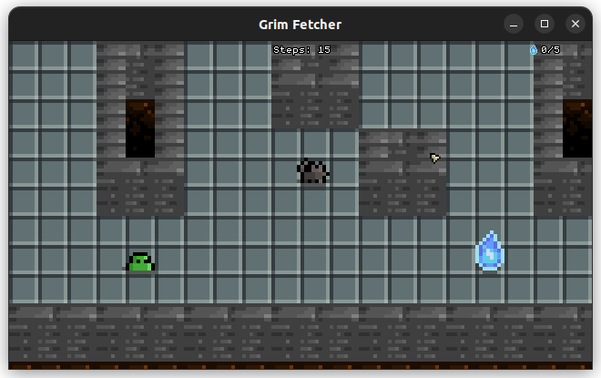

# Grim Fetcher

*Grim Fetcher* is a 2D game written in C.  

It originates from a school project which uses the MinilibX, a barebone C graphics library created for education purposes. I'm publishing *Grim Fetcher* to GitHub because it goes much further than what the subject required. I've made it my own, so I feel it's worthwhile to showcase.  

Now, the first challenge is to rewrite it with OpenGL and with the use of the PNG format instead of XPM for images.  

