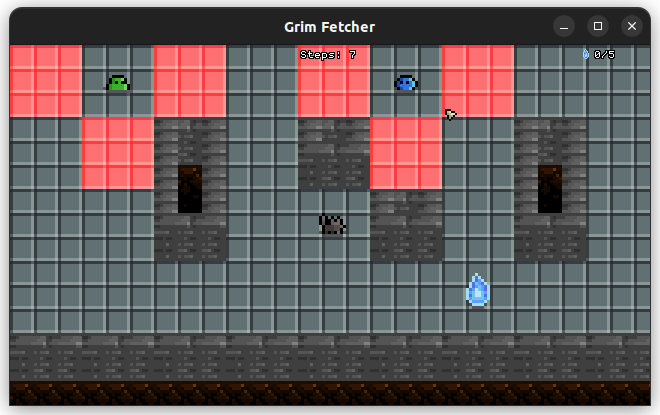

# Grim Fetcher

*Grim Fetcher* is a 2D game written in C.  

It originates from a school project which uses the MinilibX, a barebone C graphics library created for educational purposes. I'm publishing *Grim Fetcher* to GitHub because it goes much further than what the subject required. I've also seized the opportunity to port the project from MinilibX and its XPM format for images to OpenGL and PNG.  

The main character is Sua, a little dog people tend to confuse with a cat. Piece of trivia: "sua" means cat in Sumerian. Is he that old? In any case, he's a very good boy. Indeed, a dungeon keeps the souls of fallen adventurers, preventing them from joining the afterlife, and the dungeon too dangerous for clerics to come resurrect them. Sua dives into the dungeon to fetch as many souls he can before reaching the surface to release them.  

**Features**  
- X window button, Alt+F4 or ESC to close the game.
- F11 to toggle fullscreen mode.
- WASD, arrow keys or mouse left click to move.
- The clicked path is calculated with the A\* pathfinding algorithm.
- No attack button, dodge because you die on contact.
- Enemies wait for the player's first step to move.

